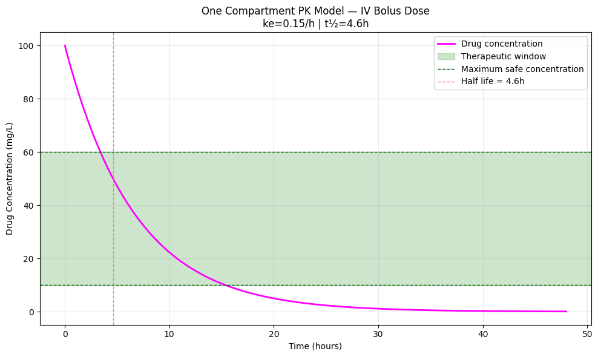

# 💊 One Compartment Pharmacokinetic Model

Simulating drug concentration in the bloodstream over time 
using a first-order ODE and SciPy's modern RK45 solver
the simplest and most widely used model in clinical pharmacology.

## 🔬 Background

When a drug is administered intravenously, it enters the bloodstream instantly 
and is eliminated at a rate proportional to its current concentration. 
This follows a first-order ODE:

**dC/dt = -ke · C**

Where:
- C  = drug concentration in blood (mg/L)
- ke = elimination rate constant (1/hour)
- t  = time (hours)

The analytical solution is a pure exponential decay:

**C(t) = C₀ · e^(-ke·t)**

Mathematically identical to **radioactive decay** in nuclear physics
same equation, but entirely different context.

## 📊 Results



| Parameter | Value |
|---|---|
| Initial dose | 100 mg/L |
| Elimination rate (ke) | 0.15 /hour |
| Half life (t½) | 4.6 hours |
| Time in therapeutic window | ~11 hours |
| ODE solver | RK45 (Runge-Kutta 4/5) |

## 🧠 Physics Concepts Demonstrated

- **First order ODE** — elimination rate proportional to current concentration
- **Exponential decay** — same mathematics as radioactive decay (λ → ke)
- **Half life** — t½ = ln(2)/ke, derived analytically from the ODE solution
- **Therapeutic window** — safe concentration range between toxic and ineffective
- **Adaptive step integration** — RK45 automatically adjusts step size for accuracy

## 🔑 Key Insight

The one compartment model assumes the body behaves as a single 
well-mixed vessel. While simplified, it accurately describes many 
real drugs and is the foundation for all more complex PK models.
The half life formula t½ = ln(2)/ke is identical to nuclear decay
a beautiful example of the same mathematics appearing 
across completely different physical systems.

## 🌍 Real World Applications

- Antibiotic dosing (e.g. penicillin, amoxicillin)
- Pain medication scheduling (e.g. ibuprofen, paracetamol)
- Chemotherapy drug monitoring
- Anesthesia dosing in surgery
- Drug approval and clinical trial design

## 🛠️ Tech Stack

- Python 3.11.9
- NumPy
- SciPy (solve_ivp — RK45)
- Matplotlib

## ▶️ How to Run

```bash
pip install numpy scipy matplotlib
```
Open `notebooks/01_one_compartment.ipynb` and run all cells in order.

## 👤 Author

Ioannis Ntontis | Physics Graduate
[LinkedIn](your-linkedin-url) | [GitHub](your-github-url)