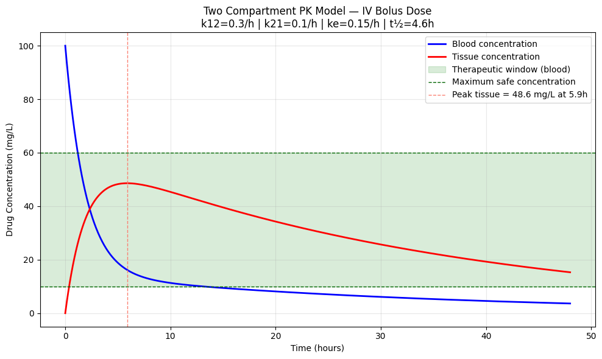
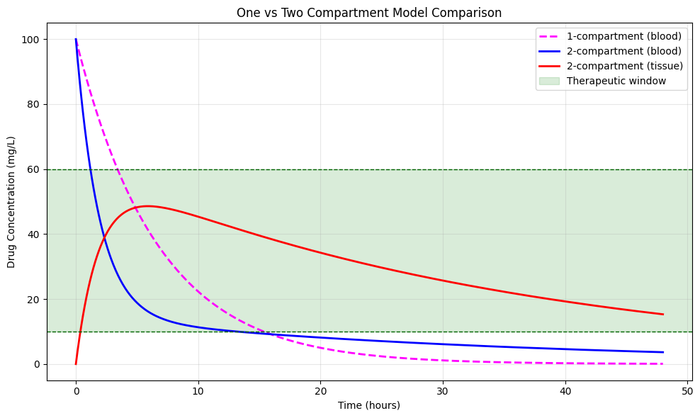

# 💊 Two Compartment Pharmacokinetic Model

Extending the one compartment model to simulate drug distribution 
between blood and tissue using a system of coupled ODEs and SciPy's modern RK45 solver
a more realistic representation of how drugs behave in the human body.

## 🔬 Background

Most drugs don't stay in the bloodstream — they distribute into 
surrounding tissues. The two compartment model captures this with 
a system of coupled ODEs:

**Blood Compartment ODE:**  $\quad \boldsymbol{\frac{dC_1}{dt} = -k_{12} \cdot C_1 + k_{21} \cdot C_2 - k_e \cdot C_1}$

**Tissue Compartment ODE:**  $\quad \boldsymbol{\frac{dC_2}{dt} = k_{12} \cdot C_1 - k_{21} \cdot C_2}$

Where:
- $C_1$  = drug concentration in blood (mg/L)
- $C_2$  = drug concentration in tissue (mg/L)
- $k_{12}$ = transfer rate blood → tissue (1/hour)
- $k_{21}$ = transfer rate tissue → blood (1/hour)
- $k_e$  = elimination rate from blood (1/hour)

Mathematically identical to **coupled oscillators** in classical 
mechanics — the tissue compartment acts as a drug reservoir, and 
the transfer rates $k_{12} / k_{21}$ play the role of coupling constants.

Unlike the one compartment model, this system has **no analytical 
solution** — numerical integration via RK45 is required.

## 📊 Results

### Two Compartment Model



### Comparison with One Compartment Model



| Parameter | Value |
|---|---|
| Initial dose | 100 mg/L |
| $k_{12}$ (blood → tissue) | 0.3 /hour |
| $k_{21}$ (tissue → blood) | 0.1 /hour |
| Elimination rate (ke) | 0.15 /hour |
| Peak tissue concentration | ~48 mg/L at hour 6 |
| ODE solver | RK45 (Runge-Kutta 4/5) |

## 🧠 Physics Concepts Demonstrated

- **Coupled ODE system** — two equations influencing each other simultaneously
- **Tissue accumulation** — drug reservoir effect in peripheral compartment
- **Redistribution** — drug flowing between compartments over time
- **Adaptive step integration** — RK45 adjusts step size automatically for accuracy
- **Numerical vs analytical** — coupled ODEs require numerical solution unlike simple decay

## 🔑 Key Insight

The tissue compartment acts as a **drug reservoir** — absorbing drug 
from blood initially, then slowly releasing it back. This explains why 
some medications remain active far longer than their blood half-life 
suggests — a critical consideration in drug design.

The comparison plot shows the key difference between models: the 
two compartment blood curve drops faster initially (drug redistributing 
into tissue) but then slower (drug releasing back from tissue). The 
one compartment model misses this behaviour entirely.

## 🌍 Real World Applications

- Anaesthetic drug distribution (e.g. propofol)
- Chemotherapy tissue penetration
- Antibiotic distribution in infected tissue
- Drug design and clinical trial planning

## 🛠️ Tech Stack

- Python 3.11.9
- NumPy
- SciPy (solve_ivp — RK45)
- Matplotlib

## ▶️ How to Run

```bash
pip install numpy scipy matplotlib
```
Open `notebooks/02_two_compartment.ipynb` and run all cells in order.
