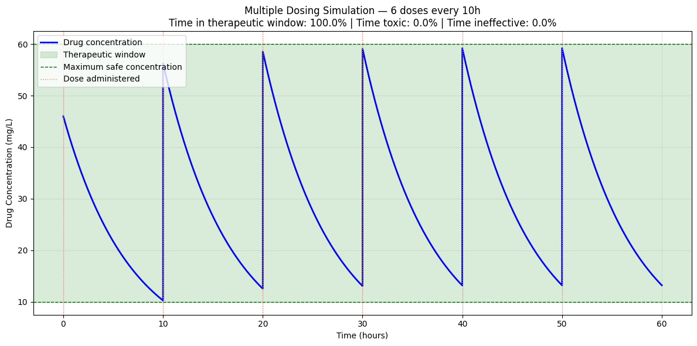
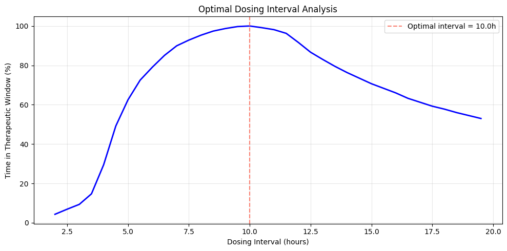

# 💊 Multiple Dosing & Optimal Dosing Interval Analysis

Simulating repeated drug administration over 48 hours and 
mathematically optimizing both dose size and dosing interval 
to maximize time in the therapeutic window.

## 🔬 Background

In clinical practice, drugs are administered multiple times per day 
to maintain concentration within the therapeutic window — the range 
between too low (ineffective) and too high (toxic).

Since the one compartment model has a known analytical solution, 
each dose interval is calculated directly using:

$\boldsymbol{C(t) = C_0 \cdot e^{-k_e \cdot t}}$

Where C₀ is the current concentration after adding the new dose. 
This is faster and more accurate than numerical integration for 
this specific case — RK45 is reserved for models without analytical 
solutions (see two compartment notebook).

The optimal dosing regime is found by maximizing the percentage 
of time concentration stays within:

- **C_min = 10 mg/L** → minimum effective concentration
- **C_max = 60 mg/L** → maximum safe concentration

## 📊 Results

### Multiple Dosing Simulation



### Optimal Dosing Interval Analysis



### Dose-Interval Optimization
| Dose (mg/L) | Best Interval (h) | Time in Window |
|---|---|---|
| 30 | 7.0 | 100% |
| 40 | 9.0 | 100% |
| 45 | 10.0 | 100% |
| 46 | 10.0 | 100% |
| 50+ | — | <100% (toxic) |

## 🧠 Physics Concepts Demonstrated

- **Analytical solution** — $\boldsymbol{C(t) = C_0 \cdot e^{-k_e \cdot t}}$ used directly for efficiency
- **Steady state accumulation** — drug building up with repeated dosing
- **Dose-interval optimization** — two-parameter sweep for optimal regime
- **Toxicity threshold** — hard ceiling above which no interval prevents accumulation

## 🔑 Key Insights

**Insight 1 — The optimal interval trade-off:**
Too frequent dosing → drug accumulates → toxic levels.
Too infrequent dosing → drug drops below effective level.
The optimal interval balances both risks.

**Insight 2 — Non-linear dose-interval relationship:**
Increasing dose improves patient compliance (longer intervals = 
fewer doses per day) up to a hard threshold of ~48 mg/L. Beyond 
this, drug accumulation causes toxicity regardless of interval — 
a critical finding for Phase I clinical trial design.

**Insight 3 — Analytical vs numerical:**
The one compartment ODE has a known closed form solution, making 
numerical integration unnecessary. Using the analytical solution 
directly reduces computation time by over 100x — essential when 
running thousands of optimization iterations.

## 🌍 Real World Applications

- Antibiotic treatment schedules (e.g. amoxicillin)
- Chemotherapy cycle planning
- Insulin dosing for diabetic patients
- Phase I clinical trial dose escalation design

## 🛠️ Tech Stack

- Python 3.11.9
- NumPy
- Matplotlib

## ▶️ How to Run

```bash
pip install numpy matplotlib
```
Open `notebooks/03_multiple_dosing.ipynb` and run all cells in order.
